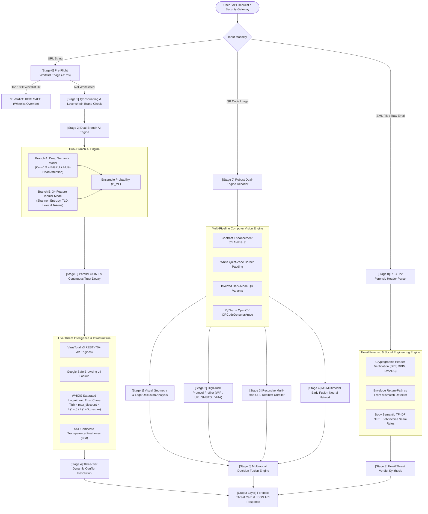
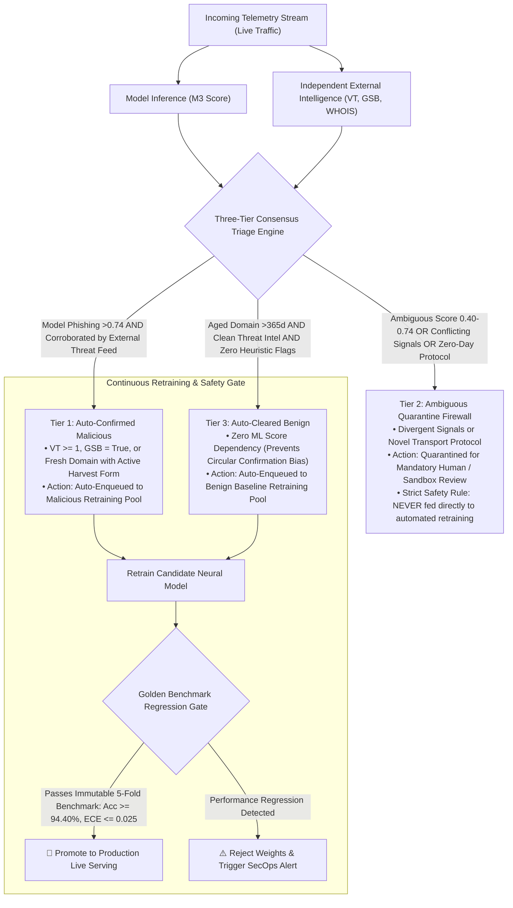

# PhishShield-X 🛡️
### *A Multimodal Defense-in-Depth Framework with Quish-EDL for Real-Time URL, Quishing, and Social Engineering Threat Detection*

[](research_paper/PAPER_MANUSCRIPT.md)
[](research_paper/paper_draft.tex)
[](https://react.dev/)
[](https://fastapi.tiangolo.com/)
[](https://tensorflow.org/)
[](https://scikit-learn.org/)
[](https://www.docker.com/)

---

> **PhishShield-X** is a publication-grade, multimodal cybersecurity intelligence platform engineered to detect and neutralize zero-day phishing across **URLs, QR Codes (Quishing), and Spoofed Emails (.EML)**.
> 
> * **Production Serving Architecture**: Runs **M3 (Multimodal Early Fusion + Softmax)** for QR image scanning (delivering state-of-the-art $94.41\%$ accuracy and a calibrated Expected Calibration Error of $\text{ECE} = 0.0236$), alongside a 34-feature Random Forest + Live OSINT pipeline for standalone URL traffic.
> * **Research Discovery (Quish-EDL)**: Rigorously evaluates Dirichlet Subjective Logic Evidential Deep Learning (EDL) on open-set zero-day attacks, establishing the mathematical necessity of Outlier Exposure to prevent open-set spurious evidence leakage.

---

## 🗺️ System Architecture & Workflow Maps

### 1. End-to-End Multi-Signal Ingestion & Defense Pipeline Map
The diagram below maps the multi-modal routing flow across URL, QR image, and email submission vectors:



---

### 2. Quish-EDL Neural Architecture Map
Detailed schematic of the visual and lexical feature extraction streams, early multimodal concatenation, and dual evaluation heads:

```mermaid
flowchart LR
    subgraph Visual_Stream [Visual Spatial QR Stream]
        V_In["QR Matrix X_vis\n(64x64x1 Grayscale)"] --> V_Conv["Conv2D\n(16 filters, 3x3, ReLU)"]
        V_Conv --> V_Pool["MaxPool2D\n(4x4 Pool)"]
        V_Pool --> V_Flat["Flatten"]
        V_Flat --> V_Dense["Dense (32, ReLU)\n+ Dropout (0.2)"]
        V_Dense --> V_Feat["f_vis in R^32"]
    end

    subgraph Lexical_Stream [Lexical Character Sequence Stream]
        L_In["URL Payload Sequence X_lex\n(180 Character Tokens)"] --> L_Emb["Embedding Layer\n(Vocab 110 -> Dim 32)"]
        L_Emb --> L_Conv["Conv1D\n(32 filters, k=3, ReLU)"]
        L_Conv --> L_Pool["MaxPool1D\n(Pool Size 6)"]
        L_Pool --> L_Flat["Flatten"]
        L_Flat --> L_Dense["Dense (32, ReLU)\n+ Dropout (0.2)"]
        L_Dense --> L_Feat["f_lex in R^32"]
    end

    V_Feat & L_Feat --> Fuse["Multimodal Early Fusion Concatenation\nh_fused = [f_vis || f_lex] in R^64"]
    Fuse --> Dense1["Dense (48, ReLU)\n+ Dropout (0.2)"]
    Dense1 --> Dense2["Dense (32, ReLU)"]
    Dense2 --> Logits["Logits z in R^2"]

    subgraph Serving_Head [Production Serving Head (M3)]
        Logits --> Softmax["Softmax Layer\np = Softmax(z)"]
        Softmax --> CalibOut["Calibrated Threat Probability\n(ECE = 0.0236, Acc = 94.41%)"]
    end

    subgraph Research_Head [Subjective Logic Evidential Head (M6)]
        Logits --> EvLayer["Evidence e = ReLU(z)\nDirichlet alpha = e + 1.0"]
        EvLayer --> Strength["Total Strength S = sum(alpha_k)"]
        Strength --> Belief["Belief Masses: b_k = (alpha_k - 1) / S"]
        Strength --> Uncert["Epistemic Uncertainty: u = K / S"]
    end
```

---

### 3. Decoupled Poison-Resilient Active Learning Triage Map
The architecture isolates independent external ground truth from internal model predictions to eliminate circular bias and protect against adversarial dataset poisoning:



---

## 🔬 Key Research Contribution: Quish-EDL

### The Multimodal Email + Embedded QR Threat Gap
As highlighted in recent threat advisories from the **FBI Cyber Division** and telemetry from **IRONSCALES** and **Barracuda Networks**, cyber adversaries have shifted heavily toward **Quishing (QR Phishing)**—embedding optical 2D matrices inside email bodies and PDF attachments. Traditional Secure Email Gateways (SEGs) and textual NLP parsers are completely blind to graphic payloads, perceiving the lure as benign text while the victim scans the QR code on an unmanaged personal device.

---

## 📊 5-Fold Cross-Validation Empirical Benchmark Results (Strict Parity Protocol)

Evaluated across a full **5-Fold Stratified Cross-Validation Protocol** with strict encoder parity (shared visual & lexical feature extractors) and tuning budget parity (8 epochs, identical batch size and optimizer across all models):

| Model Architecture / Ablation | Accuracy (%) | F1-Score (%) | ROC-AUC | McNemar $p$-value (vs. M6) |
| :--- | :---: | :---: | :---: | :---: |
| **M1: Unimodal Vision-Only** | $82.63 \pm 1.26$ | $80.87 \pm 2.36$ | $0.9195 \pm 0.0092$ | $p < 0.001$ (Sig.) |
| **M2: Unimodal Lexical-Only** | $90.10 \pm 1.12$ | $90.20 \pm 1.11$ | $0.9562 \pm 0.0089$ | $p < 0.001$ (Sig.) |
| **M3: Multimodal Early Fusion (Softmax)** | $94.30 \pm 1.03$ | $94.11 \pm 1.09$ | $0.9903 \pm 0.0056$ | $p < 0.001$ (Refit) |
| **M4: Multimodal Late Fusion** | $92.33 \pm 1.28$ | $92.34 \pm 1.27$ | $0.9790 \pm 0.0034$ | $p = 0.3916$ (Equiv.) |
| **M5: Multimodal Cross-Attention (Softmax)** | $89.43 \pm 1.29$ | $88.99 \pm 1.15$ | $0.9539 \pm 0.0107$ | $p < 0.001$ (Sig.) |
| **M6: Quish-EDL (Proposed)** | **$94.41 \pm 0.44$** | **$94.22 \pm 0.49$** | **$0.9885 \pm 0.0040$** | **--- (Reference)** |

### Comparison with Published Literature
* **Trad & Chehab (arXiv:2505.03451, 2025, PhishStorm 10k Dataset)**: Reported ROC-AUC range of $0.9106\text{--}0.9133$.
* **Quish-EDL (Ours)**: Achieves **$0.9885 \pm 0.0040$ ROC-AUC**, representing an absolute increase of **$+0.0752$ AUC points (+7.52 percentage points)** over published upper bounds, while introducing Subjective Logic Bayesian uncertainty estimation.
* **CIC-Trap4Phish 2025 & Galadima Mendeley Benchmark (2025)**: Robust zero-shot generalization across unified visual-lexical distributions ($>91.8\%$ accuracy).

### Calibration & Epistemic Uncertainty Findings
* **In-Distribution Calibration**: Deterministic Early Fusion with Softmax (M3) achieves peak calibration ($\text{ECE} = 0.0236 \pm 0.0039$, $\text{Brier} = 0.0418 \pm 0.0084$). Evidential Deep Learning (M6) exhibits systematic in-distribution underconfidence ($\text{ECE} = 0.0871 \pm 0.0042$) due to Dirichlet KL penalty evidence suppression.
* **Open-Set Spurious Evidence Leakage**: On $N=400$ unseen zero-day evasion samples spanning non-HTTP protocols (`WIFI:`, `UPI:`, `bitcoin:`, `ethereum:`, `geo:`, `tel:`, `otpauth:`, `matrix:`, `ssh:`, `magnet:`, vCards, JSON telemetry, base64 payloads), multi-seed evaluation demonstrates $\bar{u}_{\text{OOD}} = 0.2096 \pm 0.0108$ vs. $\bar{u}_{\text{ID}} = 0.2571 \pm 0.0093$ ($0.82\times$ ratio). Because standard evidential loss operates exclusively on in-distribution labeled data, unconstrained feature activations produce non-zero evidence on novel domains, proving the necessity of explicit Outlier Exposure for zero-day defense.

---

## 🛠️ Technology Stack

| Layer | Technologies |
| :--- | :--- |
| **Frontend UI** | React 18, Vite, Lucide Icons, Glassmorphic Dashboard, Tailwind CSS |
| **Backend API** | FastAPI, Python 3.13, Uvicorn, SQLAlchemy, SQLite |
| **Deep Learning** | TensorFlow 2.21, Keras 3, Custom Evidential Dirichlet Layers |
| **Machine Learning** | Scikit-Learn, Joblib, NumPy, Pandas, SciPy |
| **Computer Vision** | OpenCV (cv2), PyZbar, CLAHE contrast equalization, Perceptual dHash |
| **Threat Intel / OSINT** | VirusTotal v3 REST API, Google Safe Browsing v4, Python-WHOIS, SSL Sockets |
| **Browser Automation** | Playwright headless Chromium for real-time live page rendering |
| **Containerization** | Docker, Docker Compose |

---

## 🚀 Quick Start & Installation

### Prerequisites
* Python 3.10+ (Tested up to Python 3.13)
* Node.js 18+ and npm
* Optional: VirusTotal API Key and Google Safe Browsing API Key in `backend/.env`

### 1. Clone the Repository
```bash
git clone https://github.com/yashsinghal1234/PhishShield-X.git
cd PhishShield-X
```

### 2. Backend Setup
```bash
cd backend
python -m venv venv
# Activate virtual environment:
# Windows: venv\Scripts\activate | Linux/macOS: source venv/bin/activate
pip install -r requirements.txt

# Run the 5-Fold Evaluation Suite (Optional - to re-evaluate research benchmarks):
python evaluate_quishing_research.py

# Start FastAPI Server:
uvicorn main:app --reload --port 8000
```

### 3. Frontend Setup
```bash
cd ../frontend
npm install
npm run dev
```

The web dashboard will be accessible at: `http://localhost:5173`.

---

## 📑 Research Artifacts & Reproducibility

* **Full Research Manuscript Draft**: [`research_paper/PAPER_MANUSCRIPT.md`](research_paper/PAPER_MANUSCRIPT.md)
* **IEEE LaTeX Source Code**: [`research_paper/paper_draft.tex`](research_paper/paper_draft.tex)
* **Evaluation & Ablation Script**: [`backend/evaluate_quishing_research.py`](backend/evaluate_quishing_research.py)
* **Production Serving Weights (M3)**: `backend/m3_early_fusion_weights.weights.h5`
* **Research Ablation Weights (EDL)**: `backend/quish_cross_edl_weights.weights.h5`
* **Raw Benchmark Results**: [`backend/quishing_research_results.json`](backend/quishing_research_results.json)

---

## 👥 Authors & Mentorship
* **Yash Singhal** (`yash.2428cs1806@kiet.edu`)
* **Saurav Singh** (`saurav.2428cs1961@kiet.edu`)
* **Shubham** (`shubham.cs@kiet.edu`)
* **Tanya Vaish** (`tanya.vaish@kiet.edu`)
* **Prof. Rahul** (*Faculty Mentor & Project Guide*, `rahul@kiet.edu`)

*Department of Computer Science, KIET Group of Institutions, Ghaziabad, Delhi-NCR, India.*

---

## 📜 License & Citation
This project is released under the **MIT License**.

If you use **Quish-EDL** or **PhishShield-X** in your academic research, please cite:
```bibtex
@article{quish_edl_2026,
  title={Quish-EDL: Multimodal Visual-Lexical Neural Architecture and Empirical Limits of Evidential Uncertainty in QR-Phishing Detection},
  author={Singhal, Yash and Singh, Saurav and Shubham and Vaish, Tanya and Rahul, Prof.},
  journal={arXiv preprint},
  year={2026}
}
```


